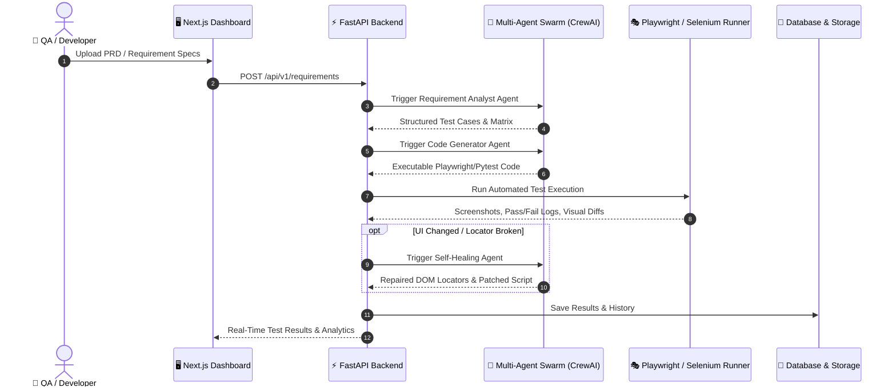

<div align="center">

# 🤖 AutoTest AI

### *Autonomous Multi-Agent AI Platform for End-to-End Software Testing*

[](https://opensource.org/licenses/MIT)
[](https://www.python.org/downloads/)
[](https://nextjs.org/)
[](https://fastapi.tiangolo.com/)
[](https://www.docker.com/)
[](https://playwright.dev/)

---

**AutoTest AI** transforms raw software requirements (PRDs, SRS, user stories) into production-grade automated tests. Built with a **multi-agent AI swarm**, **Playwright**, **FastAPI**, and **Next.js**, AutoTest AI automates test generation, execution, visual regression analysis, and self-healing test repair.

</div>

---

## 🌟 Key Features

| Feature | Description |
| :--- | :--- |
| 📑 **Requirement Analysis** | AI agents ingest PRDs, SRS, and user stories to automatically extract functional requirements and edge cases. |
| 🤖 **Multi-Agent Swarm** | Specialized CrewAI & LangChain agents collaborate to design, refine, and maintain test suites. |
| ⚡ **Automated Code Generation** | Generates executable **Playwright**, **Selenium**, and **Pytest** scripts with zero manual boilerplate. |
| 🩺 **Self-Healing Locators** | AI automatically repairs broken DOM selectors when app interfaces change, preventing test decay. |
| 👁️ **Visual Regression Testing** | High-precision pixel-matching visual comparison engine with real-time visual diff viewers. |
| 🔄 **CI/CD Native** | Ready-to-use webhooks and pipeline integrations for **GitHub Actions**, **Jenkins**, and **GitLab CI**. |
| 🔒 **Privacy-First & Free AI** | Native support for local AI inference via **Ollama** (e.g., Llama 3) alongside OpenAI GPT-4. |

---

## 🏗️ Architecture & Workflow



---

## 💻 Tech Stack

### **Backend & AI Core**
- **Framework**: FastAPI (Python 3.10+)
- **AI Orchestration**: LangChain, CrewAI
- **Automation**: Playwright, Selenium, Pytest
- **Database**: SQLite (Development) / PostgreSQL (Production)
- **Task Runner**: Celery / Asyncio

### **Frontend & User Interface**
- **Framework**: Next.js 14 (App Router)
- **Language**: TypeScript
- **Styling**: Tailwind CSS, Framer Motion (Smooth UI Animations)
- **Components**: Radix UI, Lucide Icons, Shadcn

### **DevOps & Infrastructure**
- **Containerization**: Docker & Docker Compose
- **Web Server**: Nginx
- **Local AI Engine**: Ollama (Llama 3, Mistral)

---

## 🚀 Quick Start

### 1. One-Click Launch (Recommended)

#### **Windows**
Double-click `start.bat` in the root folder, or run in PowerShell:
```powershell
.\start.bat
```

#### **macOS / Linux**
Run the startup shell script in your terminal:
```bash
chmod +x start.sh && ./start.sh
```

---

### 2. Manual Local Setup

#### **Backend Setup**
```bash
cd backend
python -m venv venv

# Windows
venv\Scripts\activate
# macOS/Linux
source venv/bin/activate

pip install -r requirements.txt
cp .env.example .env
uvicorn app.main:app --reload --port 8000
```

#### **Frontend Setup**
```bash
cd frontend
npm install
cp .env.example .env.local
npm run dev
```

---

### 3. Docker Launch

Deploy the entire stack locally with Docker Compose:
```bash
docker-compose up --build
```

---

## 🌐 Application Access Points

Once servers are running, access the services via:

- 🖥️ **Frontend App**: `http://localhost:3000`
- ⚡ **Backend API**: `http://localhost:8000`
- 📚 **Swagger API Docs**: `http://localhost:8000/docs`
- 🩺 **Healthcheck**: `http://localhost:8000/health`

---

## 🔐 Environment Configuration

Create a `.env` file in the project root based on `.env.example`:

```env
# Database
DATABASE_URL=sqlite:///./autotest.db

# AI Engine Options
OPENAI_API_KEY=sk-your-openai-key-here
OLLAMA_HOST=http://localhost:11434

# Security
SECRET_KEY=your-super-secret-key-change-in-production

# Email Notifications (Optional)
SMTP_HOST=smtp.gmail.com
SMTP_PORT=587
SMTP_USER=your-email@gmail.com
SMTP_PASSWORD=your-gmail-app-password
SMTP_ENABLED=false
```

> **Security Note**: Never commit your `.env` file to git. Use environment secret managers in production.

---

## 📖 Comprehensive Guides

- 📘 [**Deployment Guide**](file:///c:/Users/shiva/OneDrive/Desktop/AutoTest%20AI/DEPLOYMENT_GUIDE.md) - Cloud deployment (Railway, Render, AWS, Vercel) & Docker setup.
- 🧪 [**Testing & Self-Healing Guide**](file:///c:/Users/shiva/OneDrive/Desktop/AutoTest%20AI/TESTING_GUIDE.md) - Detailed guide on test suites and self-healing locators.
- 🔄 [**CI/CD Integration Guide**](file:///c:/Users/shiva/OneDrive/Desktop/AutoTest%20AI/CICD_INTEGRATION.md) - Integrating webhooks with GitHub Actions & Jenkins.

---

## 📄 License

Distributed under the **MIT License**. See `LICENSE` for more information.

---

<div align="center">
Made with ❤️ for Developers & QA Teams worldwide.
</div>
